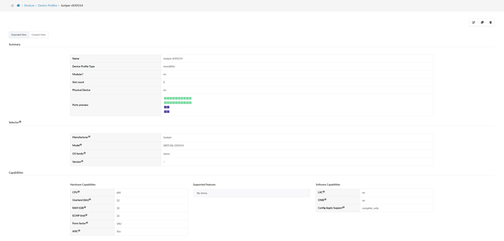
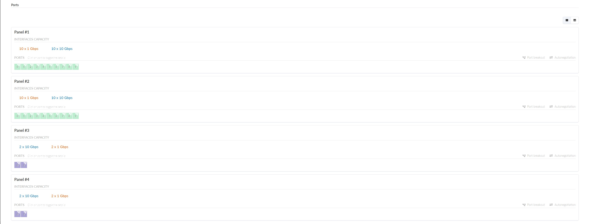

Script which adds Full vEX profile.<br>

On Apstra server:<be>

```bash
wget 'https://raw.githubusercontent.com/nchekwa/vEX9214/main/apstra/device-profiles-Juniper_vEX9214.json'
wget 'https://raw.githubusercontent.com/nchekwa/vEX9214/main/apstra/interface-map-Juniper_vEX9214__AOS-20x1%2B4x10.json'
wget 'https://raw.githubusercontent.com/nchekwa/vEX9214/main/apstra/logical-device-aos_20x1_4x10_vEX9214.json'
sh make-vEX9214.sh
```
<br>
<br>

```bash
Usage: make-vEX9214.sh [options] <apstra_ip>
Options:
  -a, --action <action>      Specify the action (create|delete). Default: create.
  -u, --user <username>      Specify the username. Default: admin.
  -p, --password <password>  Specify the password. Default: admin.
  -h, --help                 Display this help message.
Example:
  make-vEX9214.sh -a delete -u myuser -p mypassword 10.10.10.10
```

Verify if the device profile exists in Apstra:


